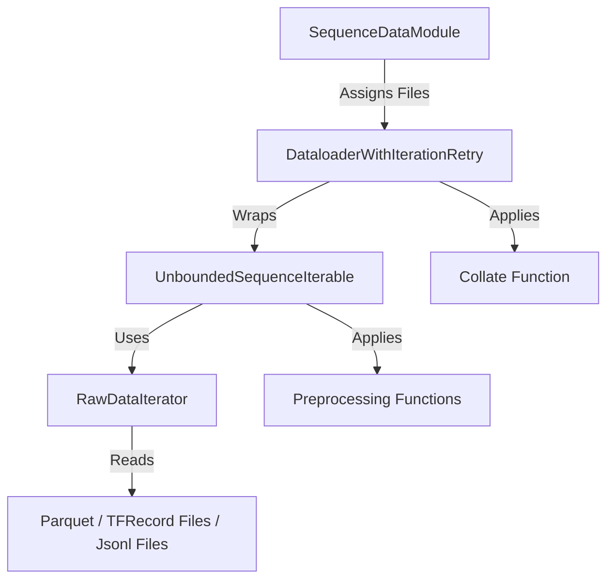

# Dataset Processing Implementation Tutorial

This document provides a detailed guide on how dataset processing is implemented in the GRID codebase. The system is designed to handle large-scale sequential data (e.g., user history) efficiently, supporting streaming from local or remote storage (like S3 or GCS) and distributed training.

> [!CAUTION]
> The `item_id` should be of type int, and starts with 0. Otherwise it will
> trigger an issue in `./src/utils/tensor_utils.py`:
> merge_list_of_keyed_tensors_to_single_tensor


## 1. Architecture Overview

The data loading pipeline follows a hierarchical structure, leveraging PyTorch Lightning's abstractions but extending them for infinite streaming and efficient large-file handling.



### Key Components

*   **`SequenceDataModule`**: The orchestrator. It scans the data directory, splits files among available GPU workers, and creates DataLoaders. It also manages the switch between file-level and row-level sharding.
*   **`DataloaderWithIterationRetry`**: A custom DataLoader that handles retries for robustness against network or data issues.
*   **`UnboundedSequenceIterable`**: An `IterableDataset` that streams data indefinitely (for training) or once (for eval). It manages the distribution of work to `RawDataIterator` via either file assignment or row-level sharding parameters.
*   **`RawDataIterator`**: Abstract base class for file readers. Implementations exist for Parquet and TFRecord, with support for row-level sharding.
*   **`Preprocessing Functions`**: Individual transformations applied to each row/batch (e.g., tokenization, casting).
*   **`Collate Functions`**: Functions that combine a list of samples into a batch, handling padding, masking, and tensor conversion.

---

## 2. Deep Dive into Components

### 2.1 SequenceDataModule (`src/data/loading/datamodules/sequence_datamodule.py`)

This is the entry point. Its primary job in `setup()` is to:
1.  **List Files**: Find all data files (e.g., `*.parquet`) in the configured directory.
2.  **Assign Files to Workers**: It uses `assign_files_to_workers` to deterministically split the list of files among the distributed workers (GPUs).
    *   *Map*: `stage_to_file_map[stage][gpu_rank] = [list_of_files]`
    *   *Sharing Status*: It also captures a boolean flag `are_files_shared`.
    *   **Hybrid Sharding**:
        *   If `num_files >= num_workers`: Each GPU gets a unique subset of files (File-Level Sharding).
        *   If `num_files < num_workers`: All GPUs get all files, and the `are_files_shared` flag is set to True (Row-Level Sharding).

### 2.2 UnboundedSequenceIterable (`src/data/loading/components/dataloading.py`)

This class implements `torch.utils.data.IterableDataset`.

*   **Worker Splitting**: Inside `__iter__` (which runs in each DataLoader worker process), it configures the workload for the specific worker.
    *   **File-Level Mode**: Splits the GPU's assigned files among the CPU workers.
    *   **Row-Level Mode**: If `are_files_shared_across_processes` is True, it assigns *all* files to the worker but configures the `RawDataIterator` to read only a specific shard of rows.
        *   Calculates `shard_id` (global worker rank) and `num_shards` (total global workers).
        *   Calls `data_iterator.set_shard_info(shard_id, num_shards)`.
*   **Streaming Loop**:
    *   **Training**: Loops infinitely over the assigned files. When the end of the file list is reached, it reshuffles (if configured) and restarts.
    *   **Validation/Test**: Iterates once and stops.
*   **Preprocessing**: It applies a chain of `preprocessing_functions` (defined in config) to each row or batch yielded by the iterator.

### 2.3 RawDataIterator (`src/data/loading/components/iterators.py`)

Handles the low-level file I/O and supports row-level sharding via `set_shard_info(shard_index, num_shards)`.

*   **`ParquetDataIterator`**:
    *   Uses `pyarrow` to read Parquet files.
    *   **Sharding**: Filters rows/batches based on index (e.g., `row_idx % num_shards == shard_index`).
*   **`TFRecordIterator`**:
    *   Uses `tf.data.TFRecordDataset`.
    *   **Sharding**: Uses native `dataset.shard(num_shards, shard_index)`.
*   **`JsonlDataIterator`**:
    *   Reads JSONL files line-by-line.
    *   **Sharding**: Yields lines where `line_idx % num_shards == shard_index`.

---

## 3. The Processing Pipeline

### Step 1: Reading
The `RawDataIterator` opens a file (local or remote via `fsspec`) and yields raw dictionaries (e.g., `{'input_ids': [1, 2, 3]}`).

### Step 2: Preprocessing (`src/data/loading/components/pre_processing.py`)
The `UnboundedSequenceIterable` passes the raw data through a list of functions. Common transformations include:
*   **`convert_bytes_to_string`**: Decodes byte strings from TFRecords.
*   **`tokenize_text_features`**: Uses a HuggingFace tokenizer on text fields.
*   **`map_sparse_id_to_semantic_id`**: Converts raw integer IDs (e.g., product ID 12345) into a sequence of semantic IDs (e.g., `[12, 45, 67]`) using a pre-computed map.
*   **`trim_sequence_row`**: Truncates sequences to a maximum length.

### Step 3: Collation (`src/data/loading/components/collate_functions.py`)
The DataLoader gathers a list of samples and calls the `collate_fn`.
*   **`collate_fn_train`**:
    *   **Padding**: Pads sequences in the batch to the same length (or `sequence_length` from config).
    *   **Masking**: Generates attention masks (`1` for data, `0` for padding).
    *   **Label Generation**: If specific fields are designated as labels, it extracts them.
    *   **Output**: Returns `SequentialModelInputData` and `SequentialModuleLabelData` dataclasses.

*   **`collate_with_sid_causal_duplicate`**:
    *   **Data Augmentation**: specifically for semantic IDs, it can generate multiple subsequence training examples from a single long history sequence (sliding window approach).

---

## 4. Configuration

The pipeline is highly configurable via Hydra (and the dataclasses in `src/data/loading/components/interfaces.py`).

A typical configuration in `configs/experiment/` might look like:

```yaml
dataset_config:
  _target_: src.data.loading.components.interfaces.SequenceDatasetConfig
  data_iterator:
    _target_: src.data.loading.components.iterators.ParquetDataIterator
  preprocessing_functions:
    - _target_: src.data.loading.components.pre_processing.convert_bytes_to_string
      features_to_apply: ["description"]
    - _target_: src.data.loading.components.pre_processing.map_sparse_id_to_semantic_id
      semantic_id_map: ...

train_dataloader_config:
  _target_: src.data.loading.components.interfaces.SequenceDataloaderConfig
  batch_size_per_device: 32
  num_workers: 4
  collate_fn:
    _target_: src.data.loading.components.collate_functions.collate_fn_train
```

## 5. Adding New Functionality

### Adding a New File Format
1.  Create a class inheriting from `RawDataIterator` in `src/data/loading/components/iterators.py`.
2.  Implement `iterrows`, `iter_batches`, and `get_file_suffix`.
3.  Update the Hydra config to use your new iterator class.

### Adding a New Preprocessing Step
1.  Define a function in `src/data/loading/components/pre_processing.py`.
2.  Signature should be `def my_func(batch_or_row, dataset_config, **kwargs) -> Dict`.
3.  Add it to the `preprocessing_functions` list in your YAML config.

### Adding a New Collate Strategy
1.  Define a function in `src/data/loading/components/collate_functions.py`.
2.  It should accept a list of samples and return `SequentialModelInputData` (or your custom data structure).
3.  Update `train_dataloader_config.collate_fn` in YAML.

## 6. Data Sinking

The inference pipeline uses a multi-stage sinking process to handle distributed outputs.

### Stage 1: Distributed Writes (Pickle)
During inference, each GPU/worker writes its predictions to local `.pkl` files using `LocalPickleWriter`.
- **Format:** List of dictionaries `[{'item_id': id, 'embedding': tensor}, ...]`.
- **Files:** `predictions_{rank}_{timestamp}.pkl`.

### Stage 2: Merging (Main Process)
At the end of inference (`on_predict_end`), the global rank 0 process:
1.  **Collects:** Loads all `.pkl` files from the output directory.
2.  **Sorts:** Sorts the file list to ensure deterministic merge order (crucial for reproducibility).
3.  **Merges:** Combines the lists into a single `merged_predictions.pkl`.

### Stage 3: Tensor Conversion
The `merged_predictions.pkl` is converted into a single PyTorch tensor `merged_predictions_tensor.pt`. This step has two modes depending on the `item_id` type:

*   **Integer IDs (Standard):**
    - The code expects `item_id` to be a dense integer index (0 to N-1).
    - It places the embedding for `item_id=k` into index `k` of the output tensor.
    - **Result:** `Tensor[k]` corresponds exactly to Item ID `k`.

*   **String IDs (Fallback):**
    - If `item_id` is a string (or non-dense integer), the indexed assignment fails.
    - The system gracefully falls back to **stacking** the embeddings in the order they appear in the merged list.
    - **Result:** `Tensor[k]` corresponds to the item at index `k` of the `merged_predictions.pkl` list.
    - **Mapping:** You MUST use `merged_predictions.pkl` to map the Tensor row index back to the original String ID. The order of the list[dict] loaded from the pkl corresponds to the output tensor.
